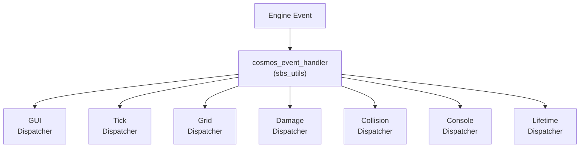

# SBS Utils
This is a lower level part of the system written in pure python.

The MAST runtime uses this functionality.

The sbs utils aspects can be used without MAST as well.
So creating pure python scripts can be created, and use many of the functions used by MAST.

Python coding can be more complex than MAST, but if you know python you may find this method useful.

## Engine event processing
The {{ab.ac}} engine calls into python calling the function `cosmos_event_handler`.

For sbs_utils this is defined in the file [handler_hooks.py](https://github.com/artemis-sbs/sbs_utils/blob/master/sbs_utils/handlerhooks.py). This gets implemented by importing the sbs_utils library from your script.py A bit of python magic makes this happen.

## FrameContext

When an event is processed by `cosmos_event_handler`, a **FrameContext** is created to hold information about that frame of execution.

---

### Task References

- **`task`** — The {{ab.m}} Task that is currently being ticked. This changes multiple times in a given frame.
- **`client_task`** — The main Task for the client associated with the event's `client_id` — i.e. the main GUI Task of the StoryPage.
- **`server_task`** — The main Task for the server (where `client_id == 0`). This is also the GUI Task of the server.

### Page References

- **`page`** — The {{ab.m}} page for the Task currently being ticked. This can change during a given frame as Tasks are ticked.
- **`client_page`** — The page for the client's main GUI Task (StoryPage). Does not change during a frame.
- **`server_page`** — The page for the server Task (where `client_id == 0`).

### Event Data

- **`context`** — Holds the core values for the current frame, including:
  - **`event`** — The engine event being processed.
  - **`sim`** — The engine's simulation object.
  - **`sbs`** — The engine's API module.
- **`client_id`** — The client ID taken from the frame's event.

### Runtime References

- **`mast`** — The root {{ab.m}} instance.
- **`aspect_ratios`** — A cache of screen sizes for connected clients.
- **`shared_id`** — The ID of the Agent holding the shared variable scope.

### Error Handling

- **`error_message`** — Any error message to be displayed. Errors are collected during the frame and processed at the end of it.
